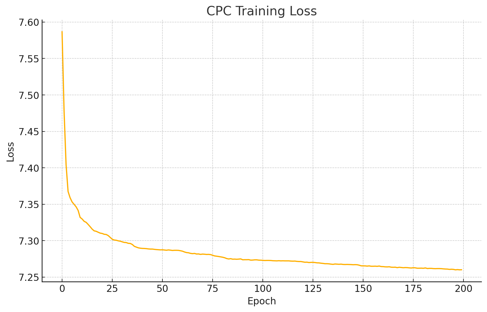

# Contrastive Predictive Coding (CPC) on UCI HAR Dataset

## Overview
This project explores predictive representation learning using Contrastive Predictive Coding (CPC) on sequential sensor data. The core idea is to train a model that learns to predict future parts of the input sequence (in latent space), without relying on labels. Specifically, the model attempts to predict latent representations of future timesteps given a context window of past signals. This allows the encoder to capture meaningful temporal dependencies across the signal data.

This project implements a self-supervised learning approach based on Contrastive Predictive Coding (CPC) to learn useful representations from the UCI HAR dataset. The CPC encoder is trained to predict future latent representations, followed by a linear probing phase to evaluate the quality of learned representations on a downstream classification task.

## Dataset
**UCI HAR Dataset**: Human Activity Recognition using smartphones. Contains inertial sensor signals from 30 individuals performing six activities (e.g., walking, sitting, etc.).

- Input shape: `[batch, 9 channels, 128 timesteps]`
- Preprocessing: normalization per channel.

### Insights from the Data
- The dataset contains rich temporal information from 9 sensor channels over fixed-size time windows (128 timesteps).
- Each activity has distinguishable signal patterns, allowing representation learning methods like CPC to capture motion-related features.
- Standardization was effective in stabilizing training, given the variability in raw sensor values.

## Architecture
The CPC model consists of:
- **Encoder**: 1D CNN to map input to latent space.
- **Projection Head**: Linear layer to reduce dimensionality.
- **Transformer Context Network**: Encodes temporal dependencies.
- **Prediction Heads**: Linear heads to predict future representations.

## Training Procedure

### Phase 1: CPC Pretraining
- **Loss**: InfoNCE loss.
- **Optimizer**: Adam.
- **Epochs**: 200.
- **Batch size**: 128.
- **Learning rate**: 1e-3.
- **k steps**: 3 future steps predicted.

### Phase 2: Linear Probing
- A frozen encoder is used to extract the last timestep's feature.
- A linear classifier is trained on top of this representation.
- **Loss**: CrossEntropy.
- **Epochs**: 100.
- **Final Accuracy**: **75.16%**

## Loss Curves

### CPC Training Loss


### Linear Probe Loss


## Conclusions

### Observations about the Data
- The dataset is well-structured and balanced across six classes, making it suitable for evaluating unsupervised and self-supervised techniques.
- Temporal consistency within samples was effectively leveraged by CPC to learn sequential patterns.
- Signal normalization improved learning stability and model convergence.

### Observations about the Algorithm
- CPC successfully captured predictive dependencies over time using a compact architecture (CNN + Transformer).
- The model demonstrated a steady decrease in InfoNCE loss, indicating effective learning of useful representations.
- The use of a Transformer-based context network allowed modeling longer-range dependencies, contributing to improved performance.

### Observations about the Results
- The CPC loss started from a relatively high value (around 7.5), which is expected in contrastive learning frameworks. This is because the InfoNCE loss operates over a large set of negative samples for each positive prediction, making the initial task difficult.
- In CPC, the loss reflects the model's ability to distinguish between correct future predictions and many incorrect alternatives. At the beginning of training, all representations are essentially random, so the model struggles to make accurate predictions, leading to high loss.
- As training progresses, the encoder and context network learn to produce structured and predictive embeddings. This results in a gradual but consistent decline in the loss, indicating improved discrimination capability.
- The final plateau of the CPC loss suggests convergence — the model has reached a stable point where it can no longer extract significantly more information from the training data under the current architecture and hyperparameters.

- After CPC pretraining, the linear probing phase showed a clear improvement in performance, achieving 75.16% accuracy on the downstream classification task. This demonstrates that the learned representations are linearly separable and highly informative, even without fine-tuning the encoder.
- The success of linear evaluation supports the effectiveness of CPC in capturing task-relevant structure from unlabeled data.

## Files
- `cpc_model.py`: Contains `Encoder` and `CPCModel` classes.
- `train_cpc.py`: CPC training loop.
- `linear_probe.py`: Evaluation using a linear classifier.
- `har_dataset.py`: UCI HAR dataset loading and normalization.
- `losses.py`: InfoNCE loss implementation.
- `utils.py`: Utility functions for training (e.g., device, checkpoint).
- `main.py`: Full pipeline runner (CPC + linear probe).

## How to Run
1. Install requirements: `torch`, `numpy`, `matplotlib`
2. Run training:
```bash
python main.py --pretrain_epochs 200 --probe_epochs 100 --hidden_dim 128
```
3. Visualize loss curves from saved logs or by extending `main.py`

## Credits
Implemented by [Your Name], based on CPCv2 concepts and UCI HAR dataset.
