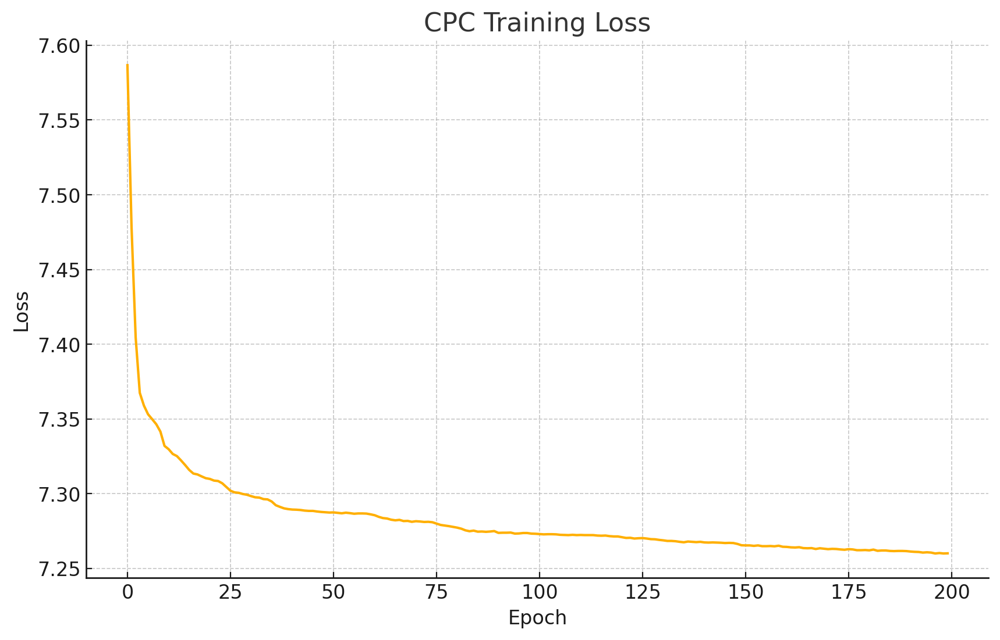
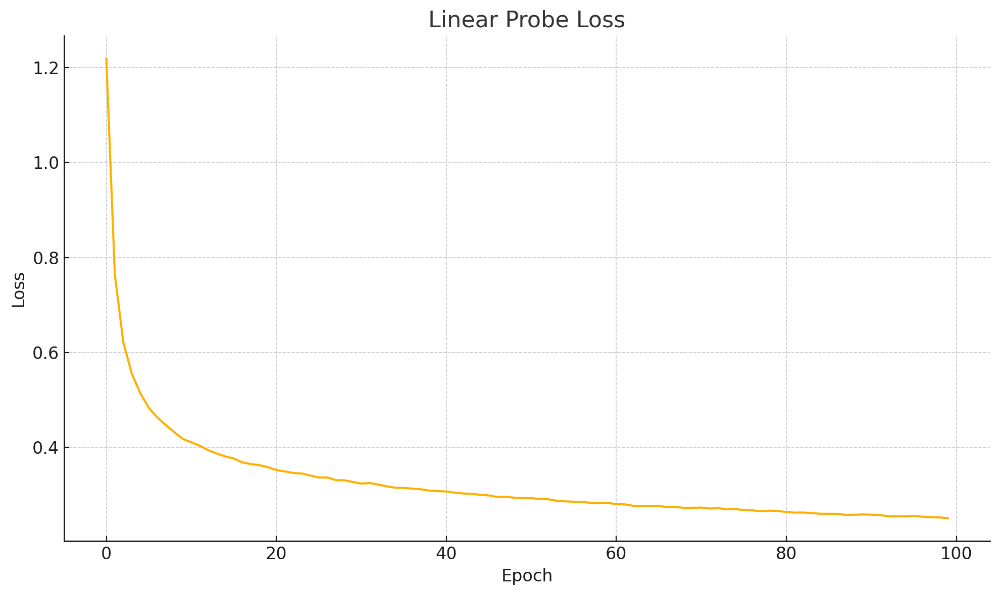

# Contrastive Predictive Coding (CPC) on UCI HAR Dataset

## Overview
This project implements a self-supervised learning approach based on Contrastive Predictive Coding (CPC) to learn useful representations from the UCI HAR dataset. The CPC encoder is trained to predict future latent representations, followed by a linear probing phase to evaluate the quality of learned representations on a downstream classification task.

## Dataset
**UCI HAR Dataset**: Human Activity Recognition using smartphones. Contains inertial sensor signals from 30 individuals performing six activities (e.g., walking, sitting, etc.).

- Input shape: `[batch, 9 channels, 128 timesteps]`
- Preprocessing: normalization per channel.

## Architecture
The CPC model consists of:
- **Encoder**: 1D CNN to map input to latent space.
- **Projection Head**: Linear layer to reduce dimensionality.
- **Transformer Context Network**: Encodes temporal dependencies.
- **Prediction Heads**: Linear heads to predict future representations.

## Training Procedure

### Phase 1: CPC Pretraining
- **Loss**: InfoNCE loss.
- **Optimizer**: Adam.
- **Epochs**: 200.
- **Batch size**: 128.
- **Learning rate**: 1e-3.
- **k steps**: 3 future steps predicted.

### Phase 2: Linear Probing
- A frozen encoder is used to extract the last timestep's feature.
- A linear classifier is trained on top of this representation.
- **Loss**: CrossEntropy.
- **Epochs**: 100.
- **Final Accuracy**: **75.16%**

## Loss Curves

### CPC Training Loss


### Linear Probe Loss


## Files
- `cpc_model.py`: Contains `Encoder` and `CPCModel` classes.
- `train_cpc.py`: CPC training loop.
- `linear_probe.py`: Evaluation using a linear classifier.
- `har_dataset.py`: UCI HAR dataset loading and normalization.
- `losses.py`: InfoNCE loss implementation.
- `utils.py`: Utility functions for training (e.g., device, checkpoint).
- `main.py`: Full pipeline runner (CPC + linear probe).

## How to Run
1. Install requirements: `torch`, `numpy`, `matplotlib`
2. Run training:
```bash
python main.py --pretrain_epochs 200 --probe_epochs 100 --hidden_dim 128
